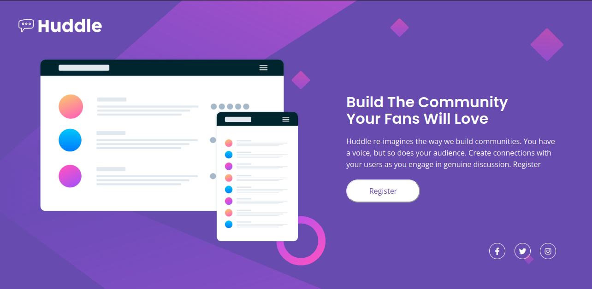
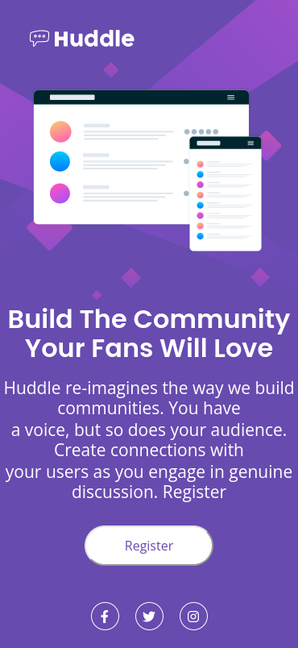

<h1 align="center"> landing-page-huddle </h1>

  <a href="#-tecnologias">Tecnologias</a>&nbsp;&nbsp;&nbsp;|&nbsp;&nbsp;&nbsp;
  <a href="#-projeto">Projeto</a>&nbsp;&nbsp;&nbsp;|&nbsp;&nbsp;&nbsp;
  <a href="#memo-licença">Licença</a>

  

 

<h1>Desktop:</h1>
  
  
<h1>Mobile:</h1>

## 🚀 Tecnologias

Esse projeto foi desenvolvido com as seguintes tecnologias:

- HTML e CSS

## 💻 Projeto

O projeto foi criado para fixar meus estudos sobre CSS GRID. Antes, tive a ideia de contruir um feed de fotos do instagram, porém depois analisar como
poderia fixar meu conhecimento tive a ideia de tentar reecriar a layout do player do youtube.

## :memo: Licença

Esse projeto está sob a licença MIT.

---
